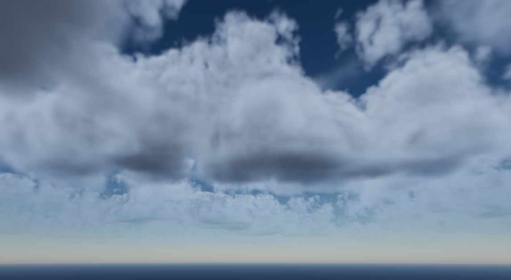
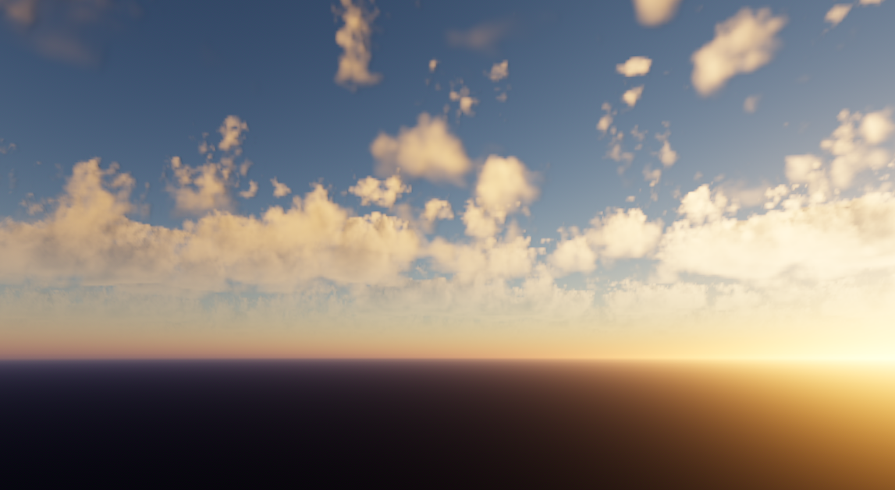

# Volumetric Clouds

This is a demo implementing one way of drawing volumetric
cloudscapes in Godot using compute shaders and sky shaders.

This demo uses animated clouds generated from ray marching
3D textures. It features automatic time of day adjustments
just by rotating the sun.

This is version 2. This approach is more in line with modern
approaches to drawing clouds. It also relies on some Godot
features only present in version 4.2 (i.e. TextureRD for
writing to a texture using compute shaders and reading that
texture in the Godot scene).

This demo requires Godot 4.2 or later.

Main differences from version 1:
1. Physically accurate atmosphere for much more realistic sky and lighting
2. Renders the hemisphere to a texture over 64 frames
    - Interpolates between two copies of that texture to hide changes
    - Very slow update, so sun has to move slowly otherwise the blending is obvious
3. Can only run on the Forward+ or Mobile rendering backends
4. Much faster (~20x)

TODOs:
1. Implement hierarchical ray marching (should make this even faster).
2. Use the transmittance LUT parametrization from Bruneton (2017)
3. Implement a noise generator so custom noise can be created and tweaked.

## How to use

In your Environment, assign "cloud_sky/clouds_sky.tres" to the "Sky" property.
Then tweak the exposed properties as you see fit.

Attach the "sun.gd" script to the DirectionLight3D that represents your sun. The
system will pull direction, energy, and color from the DirectionalLight3D
automatically.

## Screenshots

